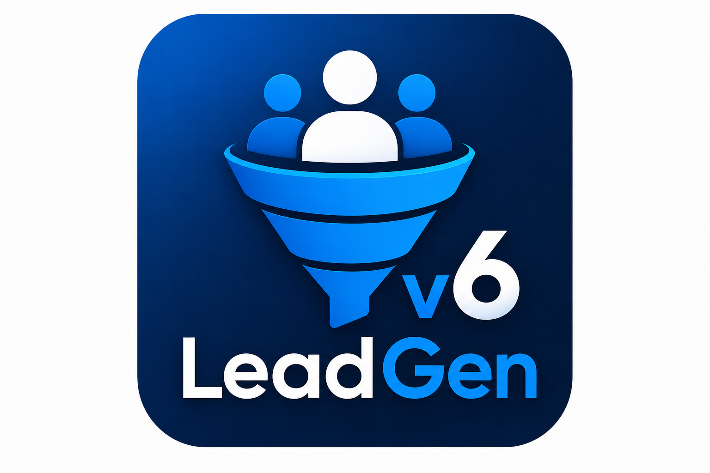
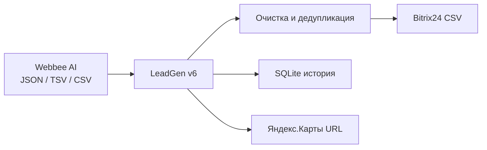

<div align="center">



<br/><br/>

# LeadGen v6

**Десктопная система лидогенерации для холодных продаж**

Обработка выгрузок Webbee AI · экспорт в Bitrix24 · генератор ссылок Яндекс.Карт

<br/>

[](https://github.com/iac-iac-iac/LeadGen_v6/actions/workflows/ci.yml)
[](https://dotnet.microsoft.com/download)
[](https://github.com/iac-iac-iac/LeadGen_v6/releases)
[](LICENSE)
[](https://github.com/iac-iac-iac/LeadGen_v6/releases/latest)

[Скачать релиз](https://github.com/iac-iac-iac/LeadGen_v6/releases/latest) · [Быстрый старт](#-быстрый-старт) · [Конфигурация](#-конфигурация)

</div>

---

## О проекте

**LeadGen v6** — WPF-приложение (MVVM) для автоматизации работы с лидами из Webbee AI: парсинг JSON/TSV/CSV, очистка телефонов и адресов, дедупликация, распределение по менеджерам и экспорт CSV для импорта в **Bitrix24**. Отдельный модуль строит поисковые ссылки **Яндекс.Карт** по городам, районам и часовым поясам.

| Модуль | Возможности |
|--------|-------------|
| **Дашборд** | Статистика за период, графики активности, история операций |
| **Обработка лидов** | Drag-and-drop файлов, премиум-прогресс, экспорт Bitrix CSV |
| **Генератор ссылок** | 42+ города, районы Москвы/СПб, UTC, пакетная генерация |
| **Менеджер городов** | Редактирование регионов, районов и таймзон в `config.json` |



---

## Требования

| Компонент | Версия |
|-----------|--------|
| ОС | Windows 10/11 |
| [.NET SDK](https://dotnet.microsoft.com/download) | 10.0 (или 8+) |
| IDE (опционально) | Visual Studio 2022 |

---

## Быстрый старт

### Из исходников

```powershell
git clone https://github.com/iac-iac-iac/LeadGen_v6.git
cd LeadGen_v6
dotnet build LeadGen.sln
dotnet run --project LeadGen
```

### Готовая сборка

1. Откройте [Releases](https://github.com/iac-iac-iac/LeadGen_v6/releases/latest)
2. Скачайте `LeadGen-v6.0.0-win-x64.zip`
3. Распакуйте и запустите `LeadGen.exe`
4. При первом запуске рядом с exe создаётся `config.json` и папка `data/`

### Visual Studio

1. Откройте `LeadGen.sln`
2. Установите проект **LeadGen** как стартовый
3. **F5** — запуск с отладкой

---

## Сборка релиза

```powershell
# Очистка старых артефактов
Remove-Item -Recurse -Force LeadGen\bin, LeadGen\obj, LeadGen.Tests\bin, LeadGen.Tests\obj, publish -ErrorAction SilentlyContinue

# Прозрачный app.ico из PNG (для exe и панели задач)
dotnet run --project tools/IconGen

# Сборка и публикация (win-x64)
dotnet publish LeadGen/LeadGen.csproj -c Release -r win-x64 -o publish/win-x64
```

### Брендинг

| Файл | Использование |
|------|----------------|
| `LeadGen/Assets/app-icon-512.png` | README, GitHub, превью |
| `LeadGen/Assets/app-icon.svg` | Интро при запуске приложения |
| `LeadGen/Assets/app.ico` | Иконка `.exe` и окна (генерируется из PNG) |

---

## Конфигурация

Файл `LeadGen/config.json` копируется в папку приложения. Основные секции:

| Секция | Назначение |
|--------|------------|
| `processing` | Формат телефона, дедупликация, мин. длина номера |
| `bitrix` | Стадия, источник, тип услуги для CSV |
| `paths` | `database`, `input_dir`, `output_dir` |
| `managers` | Список менеджеров (сохраняется после обработки) |
| `regions` | Города для генератора ссылок |
| `city_districts` | Районы (Москва, Санкт-Петербург) |
| `city_timezones` | Переопределение UTC по городам |
| `ui.animations_enabled` | Анимации интерфейса |

---

## Структура репозитория

```
LeadGen_v6/
├── LeadGen/              # WPF-приложение
│   ├── Models/           # AppConfig, LeadRecord
│   ├── Services/         # Обработка, Bitrix, SQLite, ссылки
│   ├── ViewModels/       # MVVM
│   ├── Views/            # XAML
│   ├── Themes/           # Стили
│   └── config.json       # Шаблон конфигурации
├── LeadGen.Tests/        # Unit-тесты (xUnit)
├── LeadGen.sln
└── .github/workflows/    # CI
```

---

## Тесты

```powershell
dotnet test LeadGen.sln
```

Покрытие: сервисы обработки, Bitrix-маппинг, SQLite, генератор ссылок, ViewModels.

---

## Технологии

- **WPF** + **MVVM** (CommunityToolkit.Mvvm)
- **SQLite** (Microsoft.Data.Sqlite)
- **OxyPlot** — графики на дашборде
- **xUnit** + FluentAssertions

---

## Связанные проекты

| Репозиторий | Описание |
|-------------|----------|
| [LeadGen_v5](https://github.com/iac-iac-iac/LeadGen_v5) | Предыдущая версия (Python) |
| [LeadManager_TGBot](https://github.com/iac-iac-iac/LeadManager_TGBot) | Telegram-бот для лидов + Bitrix24 |

---

## Лицензия

Проект распространяется под лицензией [MIT](LICENSE).

---

<div align="center">

**MITA** · Маркетинговое IT-агентство

Сделано для автоматизации холодных продаж

</div>
